## Demonstrate Impact of Penetration Testing to Board (BIG Guys!) -> Importance of POST EXPLOITATION ##

As a penetration tester, we often come across this riddle – What Makes Penetration Testing Really Impactful. As per penetration testing methodology – we identify vulnerability, prioritize the vulnerability considering the criticality of impacted assets, we obtain/modify/create an exploit, compromise the target system and we are all excited and happy. BUT, ‘whoami’ command output in a black screen may not mean anything to C-Suite executives, who have never opened the command prompt, or rather not need to.

So how do you explain C-suite executives the consequences/impact of the exploit which you just performed?

Here comes a skillset to our rescue – **Relevant Post Exploitation**.

1. First understand your client, their nature of the business, their clients and criticality of data etc.
2. Prioritize identified vulnerabilities and exploits to target important assets
3. Obtain/ex-filtrate the information which matters to them most
4. And they will be like WOW

To explain my point, I will walk you through some of my personal experiences in my journey as a penetration tester.

### Scenario 1 ###
---------------------

#### TL;DR: Test Server -> Apache Exploit -> In-House App  -> Hardcoded DB Credentials -> Central Database Compromise ####

In one of my earlier engagement, automated scanner identified an instance of [open apache manager console](http://blog.opensecurityresearch.com/2012/09/manually-exploiting-tomcat-manager.html) and I tried Metasploit for exploitation but observed that anti-virus installed in target machine was deleting Metasploit payload. So I switched to manual method and successfully compromised the server. Hence concluded that engagement is successful, until, client destroyed my enthusiasm saying that it’s a test machine with not much of IMPORTANCE.

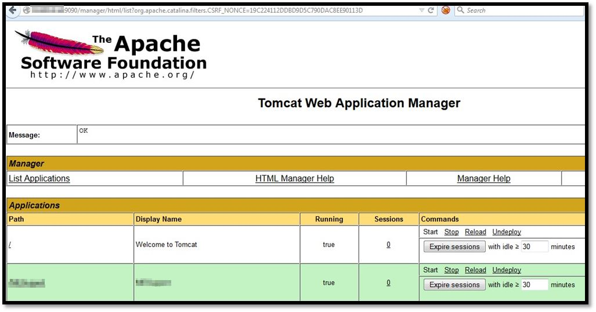
**Open Apache Tomcat Manager Console**

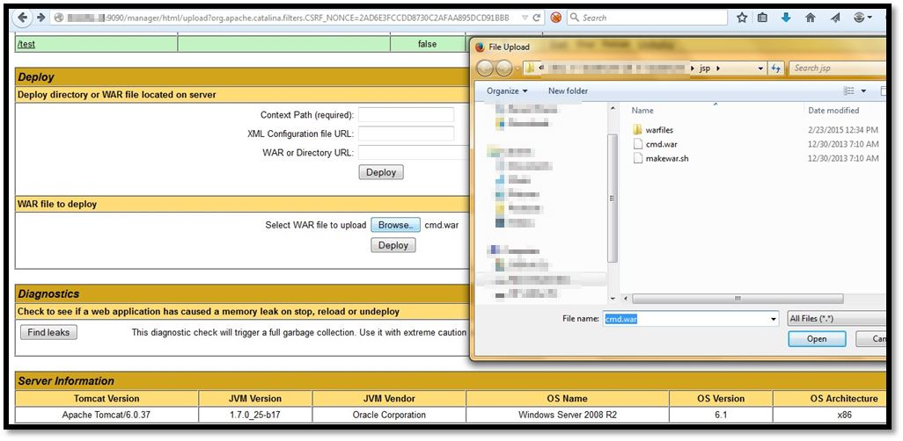
**Upload of Backdoor JSP File**

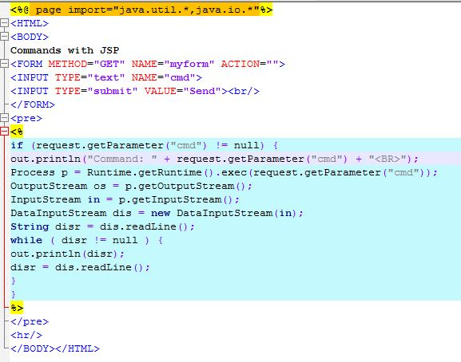

**Code of Backdoor JSP File**

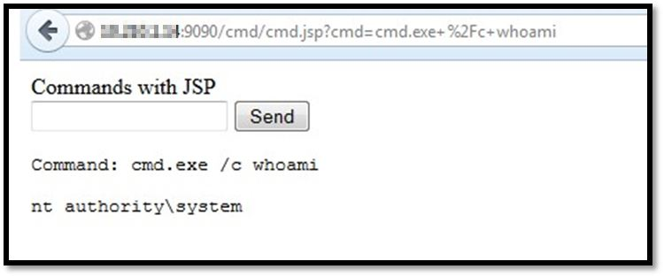

**Proof-of-Concept of Exploitation**

I had no intention of letting that issue go, so I attacked that machine again with a very definitive purpose – Obtain something critical and/or sensitive.

I created a dummy user with LOCAL ADMINISTRATIVE privileges, started the RDP and logged in using RDP just to make my life easy, relatively

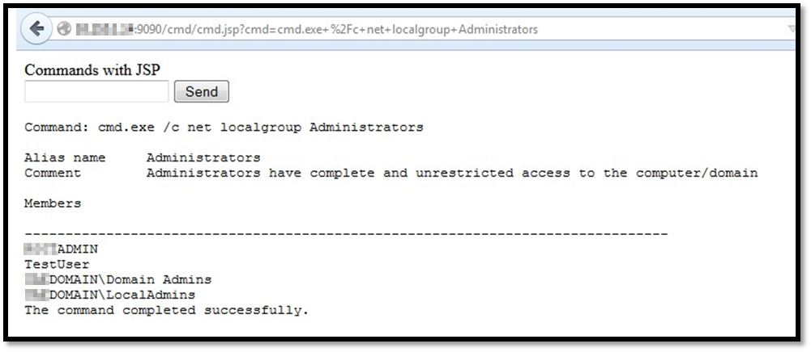
**Creation of Dummy User - TestUser**

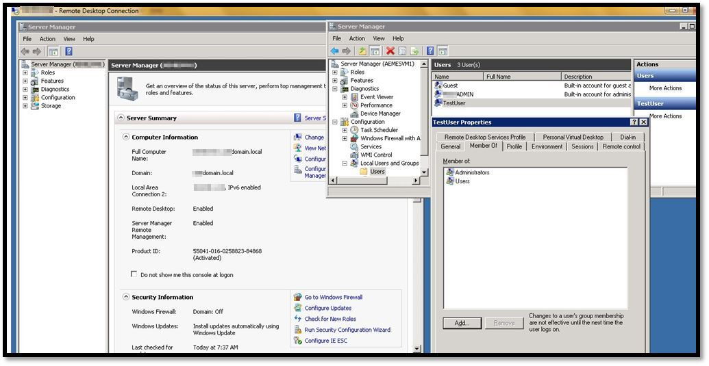
**RDP Connection to Target System**

I realised there is an in-house application in documents directory (.jar file). Out of curiosity, I just ran it, and it seemed to be data entry application. While I was doing a blind exploration in the application, a message box popped up stating that ‘Read all the entries from database successfully’. Interestingly, the application didn’t ask for any DB credentials at all.

Then, naturally, I opened the application in jd-gui and DB credentials were hard-coded in the application and to my utmost surprise, it was the credentials for central DB of the organization.

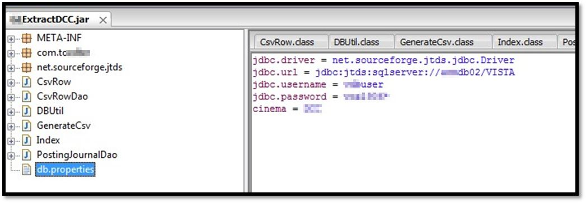
**Hard-Coded DB Credentials**

I used that credentials to login into DB and I was able to access almost all (read all) information about the organization, details of which I can’t mention here for obvious reasons.

Bottom line – Engagement become successful then, from client point-of-view and it made the life of developer of mentioned application *very* difficult.

### Scenario 2 ###
---------------------

#### TL;DR: Kiosk Device -> Windows XP -> MS08-067 -> Pass-the-Hash -> Entire Network -> (Very) Important Person Desktop Screenshot ####

In another one of my engagement, automated scanner identified that Windows XP machine is running in client environment and our favourite [MS08-067](https://www.rapid7.com/db/modules/exploit/windows/smb/ms08_067_netapi) popped me a reverse [Meterpreter](https://dev.metasploit.com/documents/meterpreter.pdf) shell with relative ease, but again, it turns out to be Kiosk Device and client were not very interested in the compromise.

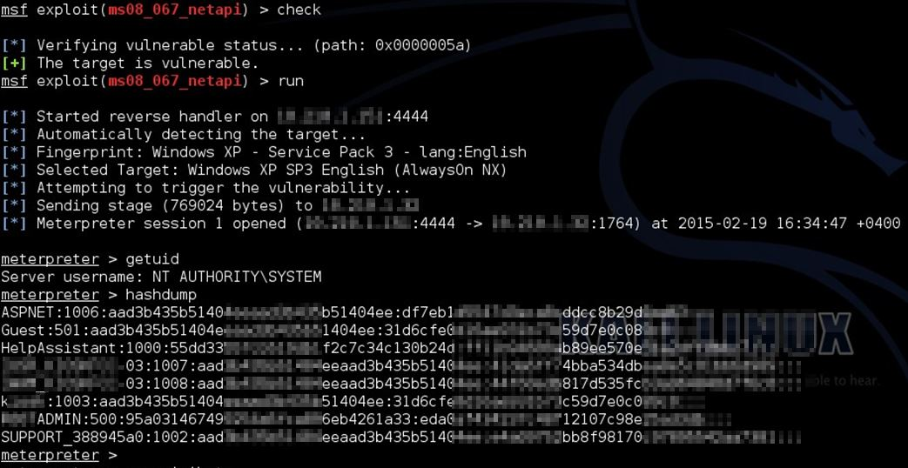
**Proof-of-Concept of Exploitation**

This time I explored the entire system but didn’t identify anything significant. Then I took a different route – [Pass-the-Hash](https://www.sans.org/reading-room/whitepapers/testing/crack-pass-hash-33219) attack. I dumped the password hashes using Meterpreter and used [smbexec](https://github.com/pentestgeek/smbexec) (awesome tool) to escalate/replicate my attack to the entire network.

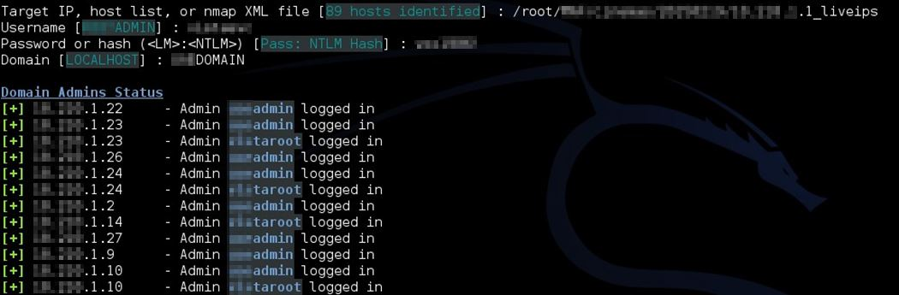
**Identification of Domain Admin User**

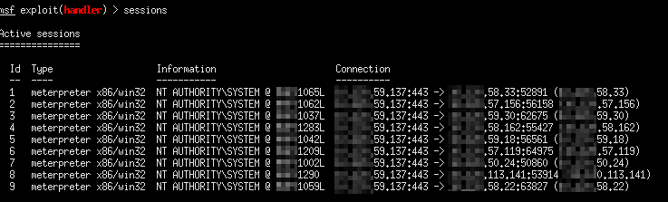

**Replicate of Attack to Entire Network**

### Scenario 3 ###
---------------------

#### TL;DR: McAfee ePO Server -> JBoss JMX Console Deployer Upload and Execute -> Combined with McAfee Weak Encryption Vulnerability -> McAfee ePO Server Password Compromised ####

This compromise was relatively simple. First automated scanner identified an open JBoss JMX console and then, I was able to obtain a Meterpreter reverse shell using the Metasploit exploit module – [JBoss JMX Deployer Upload and Execute](https://www.rapid7.com/db/modules/exploit/multi/http/jboss_maindeployer).

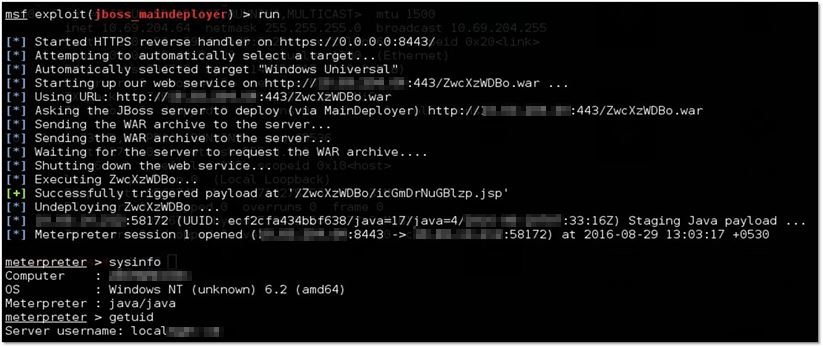
**Proof-of-Concept of Exploitation**

After a bit of reconnaissance, I realized it was an ePO server installed with vulnerable version – ePO 4.6. A ready to use post exploitation module of Metasploit – [epo_sql](https://www.rapid7.com/db/modules/post/windows/gather/credentials/epo_sql), fetched the ePO server credentials for me.

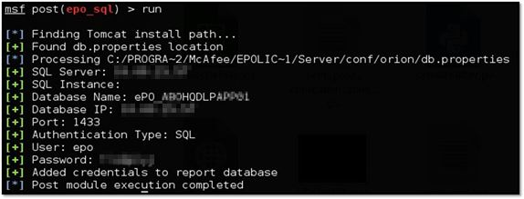

**epo_sql Metasploit Module in Action**

So, in above scenarios, by aligning post-exploitation techniques to client requirement and with a ‘dig deeper’ approach, I represented technical vulnerabilities into the form of business risk. Effective post exploitation makes the client understand the implications from the business perspective and helps them to prioritize the mitigation strategy.

In conclusion, I would like to say that relevant post exploitation is very crucial for a penetration testing engagement, especially when the client is more emphasizing on [measuring the risk not counting the vulnerabilities](https://www.darkreading.com/vulnerabilities---threats/stop-counting-vulnerabilities-and-start-measuring-risk/a/d-id/1330220). There are numerous other ways and tools for making post exploitation a real fun.

#### Further reading ####

 - https://www.offensive-security.com/metasploit-unleashed/msf-post-exploitation/
 - https://github.com/mubix/post-exploitation
 - https://www.exploit-db.com/docs/18229.pdf
 - http://www.pentest-standard.org/index.php/Post_Exploitation
 - https://www.powershellempire.com/

